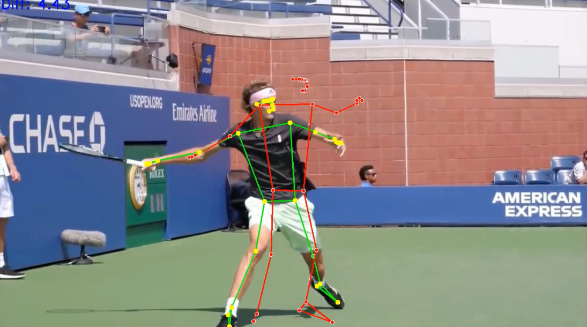

# Katoptron – AI Tennis Forehand Analyzer

Σύγκριση τεχνικής **forehand** τένις με επαγγελματία αναφορά  
→ MediaPipe Pose + DTW + **GPT-4o** προπονητική ανάλυση


<p align="center">
<p align="center">
  
  <br><small>Κόκκινος σκελετός = reference | Πράσινος = δικό σου βίντεο</small>
</p>  <br><small>Κόκκινος σκελετός = επαγγελματίας | Πράσινος = εσύ | Κίτρινα σημεία = μεγάλες αποκλίσεις</small>

## Τι κάνει η εφαρμογή

Ανέβασμα δύο βίντεο → αυτόματη ανάλυση → προπονητική ανατροφοδότηση

- Εξαγωγή **pose landmarks** (33 σημεία) με **MediaPipe**
- Χρονική ευθυγράμμιση κινήσεων με **Dynamic Time Warping (DTW)**
- Υπολογισμός διαφορών θέσεων & γωνιών αρθρώσεων
- Δημιουργία **overlay video** για οπτική σύγκριση
- **AI coaching report** από GPT-4o με:
  - εκτίμηση επιπέδου (beginner / intermediate / advanced)
  - κρίσιμα λάθη & κίνδυνος τραυματισμού
  - συγκεκριμένες διορθώσεις ανά φάση swing
  - προτεινόμενα drills & πλάνο προπόνησης

## Τεχνολογίες

| Κατηγορία           | Stack                              |
|---------------------|------------------------------------|
| Web framework       | Django 6.0                         |
| Background tasks    | Celery + Redis                     |
| Pose estimation     | MediaPipe Pose ~0.10               |
| Video processing    | OpenCV                             |
| Time-series alignment | tslearn (DTW)                    |
| AI Coaching         | OpenAI GPT-4o                      |
| Frontend            | Bootstrap 5 + vanilla JS           |
| Storage             | SQLite (dev) + filesystem (media)  |

## Γρήγορη εγκατάσταση (ανάπτυξη)

```bash
# 1. Clone & περιβάλλον
git clone https://github.com/wisper2009/katoptron.git
cd katoptron
python -m venv venv
source venv/bin/activate     # Windows → venv\Scripts\activate

# 2. Εξαρτήσεις
pip install -r requirements.txt

# 3. Ρύθμιση OpenAI κλειδιού (απαραίτητο για AI coaching)
# Εναλλακτικά: δημιουργήστε αρχείο .env
# OPENAI_API_KEY=sk-....................................

# 4. Βάση & στατικά
python manage.py makemigrations
python manage.py migrate
python manage.py collectstatic --noinput

# 5. Ξεκινήστε Redis (σε ξεχωριστό terminal)
redis-server

# 6. Celery worker (σε άλλο terminal)
celery -A katoptron worker -l INFO

# 7. Django server
python manage.py runserver